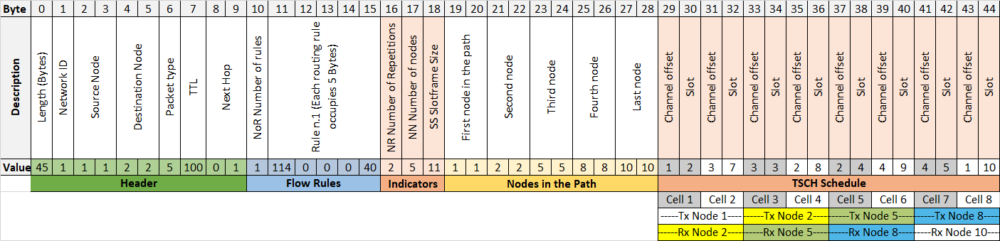

# SDN-WISE-TSCH

SDN WISE TSCH extends the performance of SDN WISE, to guarantee industrial level requirements with a highly deterministic system. To achieve this, in the medium access control layer, the CSMA protocol was replaced by the TSCH protocol. In addition, the OpenPath packet, which installed the routing rules at each node, was modified to integrate TSCH scheduling, resulting in the OpenPathTSCH packet, which allows rapid configuration of the network by flows, with a minimal increase in control traffic. The packet generation periods are synchronized according to the schedule received. To exploit this, a system was developed in the controller that integrates three application layer processes: the Traffic manager, Routing process and the TSCH Scheduler. This results in a logical separation of data flows, with a specific allocation of physical resources (cells) for each type of traffic, called slicing. This network slicing makes it possible to differentiate flows and guarantee different qualities of service. The details of how slicing works and the advantages it brings in terms of quality of service are explained in depth in "Enhancing SDN WISE with Slicing Over TSCH".

The main contribution of this paper is a TSCH network fully defined by software, integrating multiple processes from the application plane. These processes allow a slicing by flows to apply different quality of service parameters. For this purpose, significant modifications have been made to SDN-WISE. Firstly, the MAC has been changed, and secondly the operation of the OpenPath package has been extended to carry out the TSCH scheduler.

Modifications are made to version 3.0.6 of the SDN WISE Contiki, which is available in an open format. Because Contiki has a new version with improved timers for TSCH and support for more modern nodes, the project was moved to this platform. For this, it is necessary to remove the rime library that has no support in Contiki NG and link the pointers to the nullnet layer which will be the bridge between the upper layers of SDN WISE and the MAC TSCH layer. 

The following explains the modifications made to the OpenPath package, which will be called OpenPathTSCH, to encode the TSCH Scheduler information and shows a detailed example for validation as well as showing how the nodes carry out the decoding of the received frame. 
Modification of the OpenPath packet. To include TSCH functionality without increasing control traffic, the OpenPath package is extended by adding specific fields for the assignment of TSCH Scheduler, see Figure 7. The added fields have been coloured "orange". There are two groups of bytes named "Indicators" and "TSCH Schedule”. “Indicators”  consists of 3 bytes placed after Flow Rules.

*	NR (Number of Repetitions, 1 Byte): this is a field that indicates how often the route is repeated within the Slotframe. It is directly associated to the deadline of the traffic flow that will use this route and to the size of the Slotframe. It is used to inform the node of the amount of Tx cells that it must install. In addition, the MSB (Most Significant Bit) indicates the direction of flow, so a 0 is used for the flow from the Sink to the nodes (Downlink) and a 1 for the traffic from the nodes to the Sink (Uplink).

*	NN (Number of Nodes, 1 Byte): the total number of nodes that make up the route. In the original OpenPath this parameter was not necessary since it was possible to start from the packet length and the number of Flow Rules. In the case of the implementation presented in the paper, it is necessary give the information so that the scheduling bytes of each node are correctly delimited.

*	SS (Slotframe Size, 1Byte): Slotframe Size is a parameter that has implications for Throughput and energy efficiency, since for the same cell allocation, increasing Slotframe Size means more cells with the radio off, and reducing it means more frequency between transmissions. Sin embargo, los nodos deben tener la misma configuración por lo que se hace de forma explícita con este byte. However, the nodes must have the same configuration so this is explicitly done with this byte. This modification of the Slotframe Size significantly increases flexibility. As shown in the previous section, the adequate selection of the size allows the deadlines to be tightly planned, thus increasing energy efficiency. 

The bytes associated with the "TSCH Scheduler" have been placed at the end of the packet. Each cell in the schedule is encoded with 2 bytes, one for the Channel Offset and one for the Timeslot. The number of cells added here depends on the NN and the NR. Each node must have one cell per route repetition, therefore, the number of cells of a node will be equal to the NR. These cells are ordered in the same order as the route, that is, the first NR cells correspond to the first node in the route and so on.

Structure of the OpenPathTSCH packet. Generic proposal:


***Please remember to cite if this information is useful!***
## Papers

```
@Article{s21041075,
AUTHOR = {Orozco-Santos, Federico and Sempere-Payá, Víctor and Albero-Albero, Teresa and Silvestre-Blanes, Javier},
TITLE = {Enhancing SDN WISE with Slicing Over TSCH},
JOURNAL = {Sensors},
VOLUME = {21},
YEAR = {2021},
NUMBER = {4},
ARTICLE-NUMBER = {1075},
URL = {https://www.mdpi.com/1424-8220/21/4/1075},
ISSN = {1424-8220},
DOI = {10.3390/s21041075}
}
```
